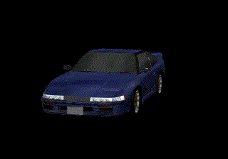

  

 

  Me llamo <strong>Christopher Gerardo Gonzalez Bustamante</strong>. Soy programador full stack que vibecodea y resuelve problemas a base de
  automatizaciones con inteligencia artificial. Todo lo que imagines se puede crear con desempeño y esfuerzo.

  
  

  
  

 

---

### ☕ Sobre mí

  <table>
    <tr>
      <td align="left" width="300px">
        <b>👤 PERSONAL</b> 
        • <b>Edad:</b> 19 
        • <b>Ubicación:</b> Costa Rica 🇨🇷 
        • <b>Bebida:</b> Coffee ☕ 
        • <b>Idioma:</b> Español 🇪🇸
      </td>
      <td align="left" width="300px">
        <b>💻 DESARROLLO</b> 
        • <b>Favorito:</b> JavaScript 
        • <b>Más usado:</b> HTML/CSS 
        • <b>Rol:</b> Programador
      </td>
      <td align="left" width="300px">
        <b>🖥️ SISTEMA</b> 
        • <b>Kernel:</b> Windows 
        • <b>Flavor:</b> 11 
        • <b>Shell:</b> PowerShell
      </td>
    </tr>
  </table>

 

  
  

 

---

### 🧰 Tech Stack & Herramientas

<strong>Frontend & UI</strong>

  
  
  
  
  
  
  
  
  
  
  

<strong>Lenguajes & Backend</strong>

  
  
  
  
  
  

<strong>Base de datos & nube</strong>

  
  
  
  
  
  
  

<strong>IA & agentes</strong>

  
  
  
  
  
  
  
  
  
  
  
  

<strong>Herramientas, diseño & colaboración</strong>

  
  
  
  
  
  
  

<strong>Sistemas operativos</strong>

  
  

---

### 📊 Estadísticas de Actividad

  
  

 

  

---

  
  
<i>"Intento crear experiencias digitales con código, creatividad y automatización."</i>

  

